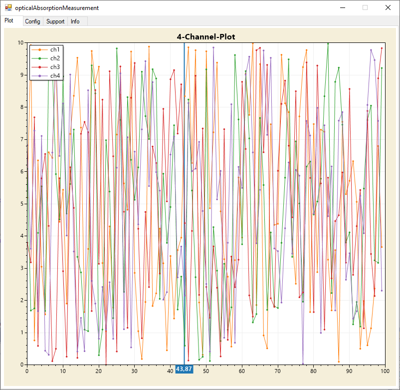

# PlotLabjack
Here you can find the software to the opticalAbsorptionMeasurement project
 
The hardware files are located under [opticalAbsorptionMeasurement](https://github.com/Johann-Schmid/opticalAbsorptionMeasurement)
 
 
**The software is located under the plotLabjack/plotLabjack/bin/Release/ directory**
 
 

